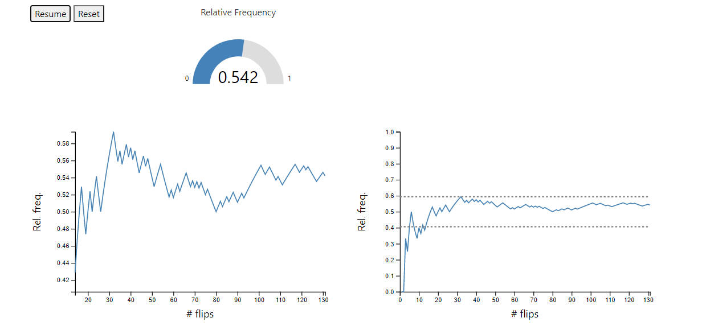
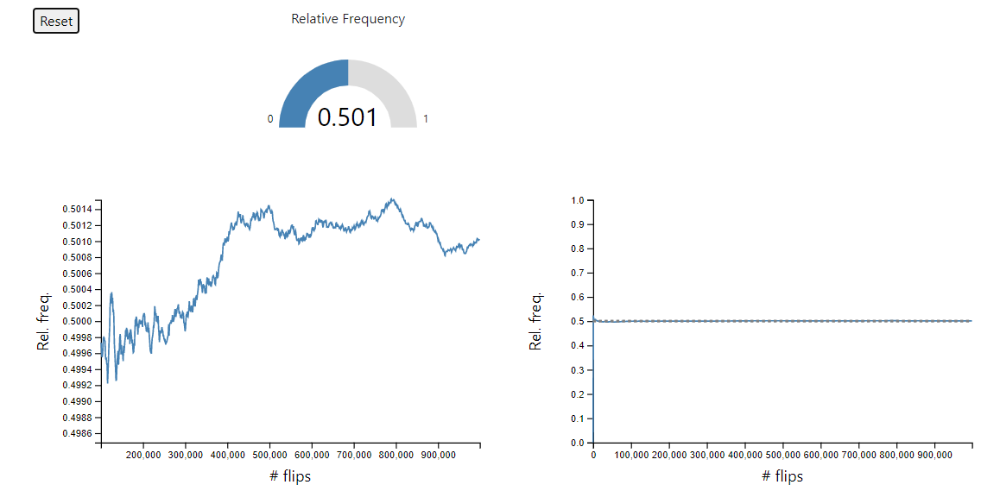

# Coin Toss Simulator

An [animated illustration](https://rustygentile.github.io/coin-toss-simulator/) of the [Law of Large Numbers](https://en.wikipedia.org/wiki/Law_of_large_numbers). With more trials, the average result of an experiment approaches the expected value.

Take a fair coin and let the value of a tails toss = 0. Let the value of a heads toss = 1. The expected value of an average toss will be 0.5. With few tosses, you might see only fair agreement with the expected value.

With many tosses though, you are guaranteed to see close agreement.

