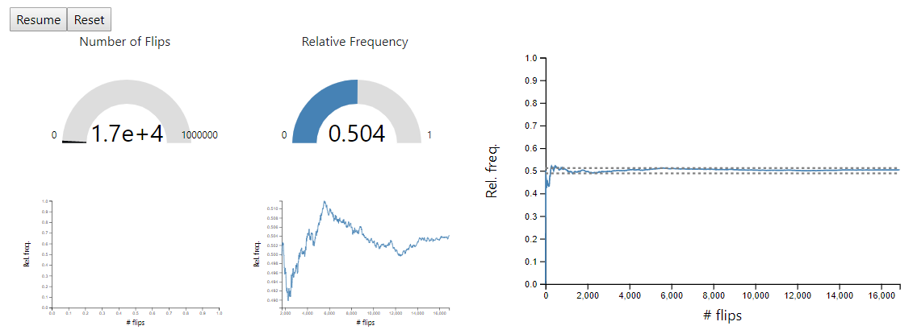

# Coin Toss Simulator

An animated illustration of the difference between relative frequency and probability. See [here](https://rustygentile.github.io/coin-toss-simulator/) to interact with the simulation.

With more samples, the relative frequency approaches the probability but will rarely equal the probability exactly. Tossing a fair coin, the probability of getting heads is 0.5. With more and more tosses, the relative frequency will be closer and closer to 0.5 more often.
